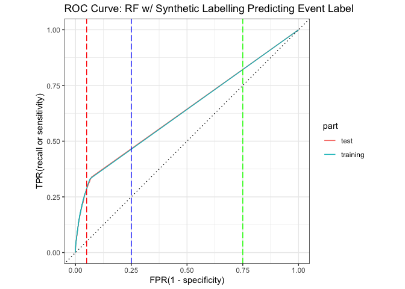

SmileGate Synthetic Labelling
================
Nicole An
2022-12-17

## Libs

``` r
options(scipen = 999)
library(tidyverse)
library(tidymodels)
library(vip)
library(solitude) # -- new package 
library(janitor)
library(ggpubr)
library(DALEX)
library(DALEXtra)
library(skimr)
options(yardstick.event_first = TRUE)
```

# Load Data

``` r
trans_train <- read_csv("smilegate_1M_transactions.csv") %>%
  clean_names() 
```

    ## Rows: 1000000 Columns: 13
    ## ── Column specification ────────────────────────────────────────────────────────
    ## Delimiter: ","
    ## chr  (3): ip_address, email_address, transaction_id
    ## dbl  (9): registration_deposit, mean_deposit, mean_txn, monetary_returns_5da...
    ## dttm (1): EVENT_TIMESTAMP
    ## 
    ## ℹ Use `spec()` to retrieve the full column specification for this data.
    ## ℹ Specify the column types or set `show_col_types = FALSE` to quiet this message.

``` r
trans_labs <- read_csv("smilegate_1M_labels.csv") %>%
  clean_names()
```

    ## Rows: 1000000 Columns: 2
    ## ── Column specification ────────────────────────────────────────────────────────
    ## Delimiter: ","
    ## chr (2): transaction_id, EVENT_LABEL
    ## 
    ## ℹ Use `spec()` to retrieve the full column specification for this data.
    ## ℹ Specify the column types or set `show_col_types = FALSE` to quiet this message.

``` r
trans_train %>% head()
```

    ## # A tibble: 6 × 13
    ##   registration…¹ mean_…² mean_…³ monet…⁴ monet…⁵ monet…⁶ game_…⁷ disti…⁸ ip_ad…⁹
    ##            <dbl>   <dbl>   <dbl>   <dbl>   <dbl>   <dbl>   <dbl>   <dbl> <chr>  
    ## 1           5754     504     453      83      58     102      39      49 43.49.…
    ## 2           6496     406     625     109     125     104      54      46 85.27.…
    ## 3           4786     549     459     148     149      76      65      46 54.225…
    ## 4           3677     639     493     109      98     112      40      64 129.98…
    ## 5           5200     435     659      61      98      92      56      52 74.230…
    ## 6           4498     376     632     122      78      89      41      62 12.219…
    ## # … with 4 more variables: email_address <chr>, event_timestamp <dttm>,
    ## #   transaction_id <chr>, account_id <dbl>, and abbreviated variable names
    ## #   ¹​registration_deposit, ²​mean_deposit, ³​mean_txn, ⁴​monetary_returns_5day,
    ## #   ⁵​monetary_returns_15day, ⁶​monetary_returns_30day, ⁷​game_cash_count_3day,
    ## #   ⁸​distinct_account_3day, ⁹​ip_address

``` r
#-- join labels
trans_train <- trans_train %>%
  left_join(trans_labs, by = c("transaction_id" = "transaction_id")) %>%
  mutate(days_since_last_pmnt = as.numeric(difftime(Sys.time(),event_timestamp))) %>%
  mutate(event_label = as.factor(event_label))
```

# Skim

``` r
trans_train %>% skim()
```

|                                                  |            |
|:-------------------------------------------------|:-----------|
| Name                                             | Piped data |
| Number of rows                                   | 1000000    |
| Number of columns                                | 15         |
| \_\_\_\_\_\_\_\_\_\_\_\_\_\_\_\_\_\_\_\_\_\_\_   |            |
| Column type frequency:                           |            |
| character                                        | 3          |
| factor                                           | 1          |
| numeric                                          | 10         |
| POSIXct                                          | 1          |
| \_\_\_\_\_\_\_\_\_\_\_\_\_\_\_\_\_\_\_\_\_\_\_\_ |            |
| Group variables                                  | None       |

Data summary

**Variable type: character**

| skim_variable  | n_missing | complete_rate | min | max | empty | n_unique | whitespace |
|:---------------|----------:|--------------:|----:|----:|------:|---------:|-----------:|
| ip_address     |         0 |             1 |   9 |  15 |     0 |     3531 |          0 |
| email_address  |         0 |             1 |  15 |  32 |     0 |     3913 |          0 |
| transaction_id |         0 |             1 |  12 |  18 |     0 |  1000000 |          0 |

**Variable type: factor**

| skim_variable | n_missing | complete_rate | ordered | n_unique | top_counts              |
|:--------------|----------:|--------------:|:--------|---------:|:------------------------|
| event_label   |         0 |             1 | FALSE   |        2 | leg: 985209, fra: 14791 |

**Variable type: numeric**

| skim_variable          | n_missing | complete_rate |     mean |       sd |       p0 |      p25 |      p50 |      p75 |     p100 | hist  |
|:-----------------------|----------:|--------------:|---------:|---------:|---------:|---------:|---------:|---------:|---------:|:------|
| registration_deposit   |         0 |             1 |  4818.73 |  1322.51 |    10.00 |  3790.00 |  4785.00 |  5840.00 |  9999.00 | ▁▅▇▃▁ |
| mean_deposit           |         0 |             1 |   499.24 |   124.59 |    10.00 |   409.00 |   502.00 |   591.00 |   999.00 | ▁▃▇▃▁ |
| mean_txn               |         0 |             1 |   511.51 |    95.11 |    10.00 |   448.00 |   512.00 |   575.00 |   999.00 | ▁▂▇▂▁ |
| monetary_returns_5day  |         0 |             1 |   109.92 |    26.32 |     0.00 |    91.00 |   113.00 |   130.00 |   199.00 | ▁▂▇▇▁ |
| monetary_returns_15day |         0 |             1 |   101.47 |    24.78 |     0.00 |    83.00 |   101.00 |   120.00 |   199.00 | ▁▃▇▃▁ |
| monetary_returns_30day |         0 |             1 |    87.09 |    18.31 |     0.00 |    75.00 |    87.00 |    99.00 |   199.00 | ▁▅▇▁▁ |
| game_cash_count_3day   |         0 |             1 |    49.57 |    12.79 |     1.00 |    40.00 |    49.00 |    59.00 |    99.00 | ▁▅▇▃▁ |
| distinct_account_3day  |         0 |             1 |    50.16 |     8.13 |     1.00 |    45.00 |    50.00 |    55.00 |    99.00 | ▁▁▇▁▁ |
| account_id             |         0 |             1 | 54976.41 | 25979.38 | 10000.00 | 32488.00 | 54938.00 | 77502.00 | 99999.00 | ▇▇▇▇▇ |
| days_since_last_pmnt   |         0 |             1 |   197.15 |   105.43 |    14.62 |   105.82 |   197.14 |   288.38 |   379.86 | ▇▇▇▇▇ |

**Variable type: POSIXct**

| skim_variable   | n_missing | complete_rate | min                 | max                 | median              | n_unique |
|:----------------|----------:|--------------:|:--------------------|:--------------------|:--------------------|---------:|
| event_timestamp |         0 |             1 | 2021-12-03 02:40:53 | 2022-12-03 08:25:20 | 2022-06-03 19:56:53 |   984283 |

## Train Test Split

``` r
set.seed(1002)

train_test_split<- initial_split(trans_train, prop = 0.7)

train <- training(train_test_split)
test  <- testing(train_test_split)


sprintf("Train PCT : %1.2f%%", nrow(train)/ nrow(trans_train) * 100)
```

    ## [1] "Train PCT : 70.00%"

``` r
sprintf("Test  PCT : %1.2f%%", nrow(test)/ nrow(trans_train) * 100)
```

    ## [1] "Test  PCT : 30.00%"

# — ISOFOR —-

-   Anomaly detection – can you identify and explain 5-10 anomalous
    records - Use Isolation Forest

## Build recipe and train model

``` r
# make a recipe 
iso_recipe <- recipe(~ registration_deposit + 
                       mean_deposit +
                       mean_txn + monetary_returns_5day + monetary_returns_15day + monetary_returns_30day + game_cash_count_3day + distinct_account_3day + days_since_last_pmnt
                       , data=train) %>% 
  step_impute_mean(all_predictors()) %>% 
  prep()

# bake it
iso_prep_train <- bake(iso_recipe, train)
iso_prep_test <- bake(iso_recipe, test)

# init a isoforest 
set.seed(512)
iso_forest <- isolationForest$new(
  sample_size = 2048,
  num_trees = 100,
  max_depth = 12)
# fit
iso_forest$fit(iso_prep_train)
```

    ## INFO  [18:14:47.616] Building Isolation Forest ...
    ## INFO  [18:15:01.367] done
    ## INFO  [18:15:01.381] Computing depth of terminal nodes ...
    ## INFO  [18:15:01.839] done
    ## INFO  [18:16:12.955] Completed growing isolation forest

## Predict

``` r
# --predict train
pred_fraud_train <- iso_forest$predict(iso_prep_train)
pred_fraud_train %>% skim()
```

|                                                  |            |
|:-------------------------------------------------|:-----------|
| Name                                             | Piped data |
| Number of rows                                   | 700000     |
| Number of columns                                | 3          |
| Key                                              | NULL       |
| \_\_\_\_\_\_\_\_\_\_\_\_\_\_\_\_\_\_\_\_\_\_\_   |            |
| Column type frequency:                           |            |
| numeric                                          | 3          |
| \_\_\_\_\_\_\_\_\_\_\_\_\_\_\_\_\_\_\_\_\_\_\_\_ |            |
| Group variables                                  | None       |

Data summary

**Variable type: numeric**

| skim_variable | n_missing | complete_rate |      mean |        sd |   p0 |       p25 |       p50 |       p75 |      p100 | hist  |
|:--------------|----------:|--------------:|----------:|----------:|-----:|----------:|----------:|----------:|----------:|:------|
| id            |         0 |             1 | 350000.50 | 202072.74 | 1.00 | 175000.75 | 350000.50 | 525000.25 | 700000.00 | ▇▇▇▇▇ |
| average_depth |         0 |             1 |     11.71 |      0.36 | 7.03 |     11.63 |     11.84 |     11.94 |     12.00 | ▁▁▁▁▇ |
| anomaly_score |         0 |             1 |      0.57 |      0.01 | 0.56 |      0.56 |      0.57 |      0.57 |      0.71 | ▇▁▁▁▁ |

``` r
# --predict test
pred_fraud_test <- iso_forest$predict(iso_prep_test)
pred_fraud_test %>% skim()
```

|                                                  |            |
|:-------------------------------------------------|:-----------|
| Name                                             | Piped data |
| Number of rows                                   | 300000     |
| Number of columns                                | 3          |
| Key                                              | NULL       |
| \_\_\_\_\_\_\_\_\_\_\_\_\_\_\_\_\_\_\_\_\_\_\_   |            |
| Column type frequency:                           |            |
| numeric                                          | 3          |
| \_\_\_\_\_\_\_\_\_\_\_\_\_\_\_\_\_\_\_\_\_\_\_\_ |            |
| Group variables                                  | None       |

Data summary

**Variable type: numeric**

| skim_variable | n_missing | complete_rate |      mean |       sd |   p0 |      p25 |       p50 |       p75 |      p100 | hist  |
|:--------------|----------:|--------------:|----------:|---------:|-----:|---------:|----------:|----------:|----------:|:------|
| id            |         0 |             1 | 150000.50 | 86602.68 | 1.00 | 75000.75 | 150000.50 | 225000.25 | 300000.00 | ▇▇▇▇▇ |
| average_depth |         0 |             1 |     11.71 |     0.36 | 7.79 |    11.63 |     11.84 |     11.94 |     12.00 | ▁▁▁▁▇ |
| anomaly_score |         0 |             1 |      0.57 |     0.01 | 0.56 |     0.56 |      0.57 |      0.57 |      0.69 | ▇▁▁▁▁ |

# Evaluate

``` r
#sumarize
pred_fraud_train %>%
  summarise(n=n(),
            min = min(average_depth),
            max = max(average_depth),
            mean = mean(average_depth),
            min_score =  min(anomaly_score),
            max_score = max(anomaly_score),
            mean_score= mean(anomaly_score),
  )
```

    ##        n  min max     mean min_score max_score mean_score
    ## 1 700000 7.03  12 11.71327 0.5613136 0.7129782     0.5692

``` r
#pred_fraud_test %>%
#  summarise(n=n(),
#            min = min(average_depth),
#            max = max(average_depth),
#            mean = mean(average_depth),
#            min_score =  min(anomaly_score),
#            max_score = max(anomaly_score),
#            mean_score= mean(anomaly_score),
#  )

# pl0t
pred_fraud_train %>%
  ggplot(aes(average_depth)) +
  geom_histogram(bins=20) + 
  geom_vline(xintercept = 10.34, linetype="dotted", 
                color = "blue", size=1.5) + 
  labs(title="Isolation Forest Average Tree Depth")
```

<!-- -->

``` r
# plot
pred_fraud_train %>%
  ggplot(aes(anomaly_score)) +
  geom_histogram(bins=20) + 
  geom_vline(xintercept = 0.6085, linetype="dotted", 
                color = "blue", size=1.5) + 
  labs(title="Isolation Forest Anomaly Score Above 0.7")
```

<!-- -->

## Make a surrogate model

### Make synthetic target above 10% recall

``` r
# Who is anomalous?
synth_fraud_train <- bind_cols(pred_fraud_train,train) %>%
  mutate(event_label = as.factor(event_label)) %>%
  mutate(synthetic_target = as.factor(
           if_else(anomaly_score >= 0.6085  ,"fraud","legit"))) %>%
  select(-id)

synth_fraud_train %>%
  subset(synthetic_target == "legit") %>%
  arrange(average_depth)
```

    ##         average_depth anomaly_score registration_deposit mean_deposit mean_txn
    ##      1:         10.33     0.6082860                 5438          185      312
    ##      2:         10.33     0.6082860                 6139          641      422
    ##      3:         10.33     0.6082860                 3600          364      904
    ##      4:         10.33     0.6082860                 6155          316      503
    ##      5:         10.33     0.6082860                 7602          536      293
    ##     ---                                                                       
    ## 691769:         12.00     0.5613136                 6071          412      459
    ## 691770:         12.00     0.5613136                 4028          512      423
    ## 691771:         12.00     0.5613136                 4149          588      500
    ## 691772:         12.00     0.5613136                 4684          497      531
    ## 691773:         12.00     0.5613136                 5268          476      520
    ##         monetary_returns_5day monetary_returns_15day monetary_returns_30day
    ##      1:                   106                     67                     83
    ##      2:                    47                     87                    108
    ##      3:                    82                     77                     92
    ##      4:                    24                     79                    117
    ##      5:                   139                     71                     75
    ##     ---                                                                    
    ## 691769:                    94                     74                     64
    ## 691770:                   122                    123                     76
    ## 691771:                   118                    122                     85
    ## 691772:                   108                    112                     97
    ## 691773:                    92                     90                     87
    ##         game_cash_count_3day distinct_account_3day      ip_address
    ##      1:                   25                    70  150.213.52.161
    ##      2:                   45                    28   196.34.81.108
    ##      3:                   39                    68   190.182.48.22
    ##      4:                   48                    29 153.230.186.207
    ##      5:                   18                    45   66.48.194.177
    ##     ---                                                           
    ## 691769:                   35                    52  128.122.26.149
    ## 691770:                   56                    53   51.65.157.125
    ## 691771:                   53                    51  34.172.179.117
    ## 691772:                   52                    54  174.54.147.170
    ## 691773:                   48                    48 102.231.126.176
    ##                           email_address     event_timestamp    transaction_id
    ##      1:           longmegan@example.org 2021-12-03 07:31:18 5302333022-509210
    ##      2:          brittany37@example.org 2022-04-07 20:36:42 2637573809-763458
    ##      3:       beverlyromero@example.net 2022-08-31 03:23:22  9555977639-87268
    ##      4:          francoerin@example.org 2022-03-01 00:28:02 2345216756-235684
    ##      5:              ebaird@example.net 2022-03-25 22:30:56 7794067068-280183
    ##     ---                                                                      
    ## 691769:             uramsey@example.com 2022-06-23 11:09:10  6628674261-36839
    ## 691770: christensenmichelle@example.com 2022-03-05 08:33:16 4508364900-361491
    ## 691771:            kyleboyd@example.org 2022-09-24 14:10:57 6914402634-648866
    ## 691772:         wareshannon@example.com 2022-06-16 07:31:02 4322396231-648259
    ## 691773:       carlamartinez@example.net 2022-06-02 11:46:12 9344153492-820900
    ##         account_id event_label days_since_last_pmnt synthetic_target
    ##      1:      71659       legit            379.65497            legit
    ##      2:      36186       legit            254.10956            legit
    ##      3:      97721       legit            108.82715            legit
    ##      4:      17140       legit            291.94891            legit
    ##      5:      57613       legit            267.03023            legit
    ##     ---                                                             
    ## 691769:      67032       legit            177.50368            legit
    ## 691770:      48493       legit            287.61194            legit
    ## 691771:      85506       legit             84.37744            legit
    ## 691772:      36715       legit            184.65516            legit
    ## 691773:      23900       legit            198.47796            legit

``` r
synth_fraud_train %>%
  count(synthetic_target)
```

    ##    synthetic_target      n
    ## 1:            fraud   8227
    ## 2:            legit 691773

``` r
synth_fraud_test <- bind_cols(pred_fraud_test,test) %>%
  mutate(event_label = as.factor(event_label))  %>%
mutate(synthetic_target = as.factor(
           if_else(anomaly_score >= 0.6085  ,"fraud","legit"))) %>%
  select(-id)


synth_fraud_test %>%
  subset(synthetic_target == "legit") %>%
  arrange(average_depth)
```

    ##         average_depth anomaly_score registration_deposit mean_deposit mean_txn
    ##      1:         10.33     0.6082860                 4149          309      882
    ##      2:         10.33     0.6082860                 7322          787      326
    ##      3:         10.33     0.6082860                 5959          782      698
    ##      4:         10.33     0.6082860                 1700          701      389
    ##      5:         10.33     0.6082860                 7470          521      241
    ##     ---                                                                       
    ## 296551:         12.00     0.5613136                 3019          549      514
    ## 296552:         12.00     0.5613136                 4336          548      654
    ## 296553:         12.00     0.5613136                 4824          451      619
    ## 296554:         12.00     0.5613136                 5512          448      505
    ## 296555:         12.00     0.5613136                 5794          328      563
    ##         monetary_returns_5day monetary_returns_15day monetary_returns_30day
    ##      1:                   112                    109                    125
    ##      2:                    99                     77                     43
    ##      3:                    93                     95                    148
    ##      4:                   174                    121                     54
    ##      5:                    99                     65                    102
    ##     ---                                                                    
    ## 296551:                   126                    105                     78
    ## 296552:                   112                    115                     97
    ## 296553:                   110                    120                     99
    ## 296554:                    92                     62                     81
    ## 296555:                    88                    108                    105
    ##         game_cash_count_3day distinct_account_3day      ip_address
    ##      1:                   46                    67      54.8.52.73
    ##      2:                   36                    39  84.171.103.123
    ##      3:                   49                    34 222.220.247.126
    ##      4:                   69                    63  208.75.243.170
    ##      5:                   29                    30  133.198.194.88
    ##     ---                                                           
    ## 296551:                   62                    54 131.189.114.103
    ## 296552:                   60                    45   163.248.38.52
    ## 296553:                   58                    48   112.78.37.166
    ## 296554:                   37                    52     15.217.6.24
    ## 296555:                   47                    50   208.234.26.49
    ##                      email_address     event_timestamp    transaction_id
    ##      1:       garykemp@example.org 2022-06-30 17:19:29   3543181032-3980
    ##      2: santosjennifer@example.com 2022-05-06 00:02:52  4394900470-11624
    ##      3:  melissawilson@example.org 2022-05-13 23:31:52  1927193993-18853
    ##      4:      brownjohn@example.com 2022-07-26 17:44:46  2328247694-36182
    ##      5:      juliahall@example.net 2022-01-25 19:18:42  1297120834-61473
    ##     ---                                                                 
    ## 296551:        brian51@example.net 2022-02-03 19:13:13 3020871274-999754
    ## 296552:         ryan13@example.com 2022-03-01 01:01:23 6083223025-999791
    ## 296553:      timothy36@example.net 2022-04-17 15:56:28 9686449819-999923
    ## 296554:         gary69@example.org 2022-08-25 04:32:06 6812533177-999931
    ## 296555:          ycruz@example.net 2022-09-21 05:37:57 9134037075-999982
    ##         account_id event_label days_since_last_pmnt synthetic_target
    ##      1:      86373       legit            170.24651            legit
    ##      2:      85897       legit            225.96639            legit
    ##      3:      33893       legit            217.98791            legit
    ##      4:      63649       legit            144.22896            legit
    ##      5:      75483       legit            326.16372            legit
    ##     ---                                                             
    ## 296551:      93843       legit            317.16753            legit
    ## 296552:      40075       legit            291.92575            legit
    ## 296553:      98843       legit            244.30416            legit
    ## 296554:      84582       legit            114.77942            legit
    ## 296555:      17377       legit             87.73369            legit

``` r
synth_fraud_test %>%
  count(synthetic_target)
```

    ##    synthetic_target      n
    ## 1:            fraud   3445
    ## 2:            legit 296555

### Evaluate threshold

``` r
# -- confusion matrices
synth_fraud_train %>%
yardstick::conf_mat(event_label,synthetic_target) %>%
autoplot(type = "heatmap") + 
labs(title="Train Confusion Matrix")
```

<!-- -->

``` r
synth_fraud_test %>%
yardstick::conf_mat(event_label,synthetic_target) %>%
autoplot(type = "heatmap") + 
labs(title="Test Confusion Matrix")
```

<!-- -->

``` r
# -- precision and recall
synth_fraud_train %>%
yardstick::precision(event_label, synthetic_target) %>%
mutate(part="training") %>%
bind_rows(
synth_fraud_test %>%
yardstick::precision(event_label, synthetic_target) %>%
  mutate(part="testing") 
)
```

    ## Warning: The `yardstick.event_first` option has been deprecated as of yardstick 0.0.7 and will be completely ignored in a future version.
    ## Instead, set the following argument directly in the metric function:
    ## `options(yardstick.event_first = TRUE)`  -> `event_level = 'first'` (the default)
    ## `options(yardstick.event_first = FALSE)` -> `event_level = 'second'`
    ## This warning is displayed once per session.

    ## # A tibble: 2 × 4
    ##   .metric   .estimator .estimate part    
    ##   <chr>     <chr>          <dbl> <chr>   
    ## 1 precision binary         0.135 training
    ## 2 precision binary         0.132 testing

``` r
synth_fraud_train %>%
yardstick::recall(event_label, synthetic_target) %>%
mutate(part="training") %>%
bind_rows(
synth_fraud_test %>%
yardstick::recall(event_label, synthetic_target) %>%
  mutate(part="testing") 
)
```

    ## # A tibble: 2 × 4
    ##   .metric .estimator .estimate part    
    ##   <chr>   <chr>          <dbl> <chr>   
    ## 1 recall  binary         0.108 training
    ## 2 recall  binary         0.102 testing

``` r
synth_fraud_test %>%
 roc_curve(event_label, anomaly_score)  %>%
 mutate(
   fpr = round((1 - specificity), 3),
   tpr = round(sensitivity, 3),
   threshold =  round(.threshold, 3)
 ) %>%
 group_by(tpr) %>%
 summarise(fpr = min(fpr),
           threshold = max(threshold)) %>%
 filter(tpr<=0.12) %>% print()
```

    ## # A tibble: 91 × 3
    ##      tpr   fpr threshold
    ##    <dbl> <dbl>     <dbl>
    ##  1 0         0   Inf    
    ##  2 0.001     0     0.67 
    ##  3 0.002     0     0.663
    ##  4 0.003     0     0.657
    ##  5 0.004     0     0.654
    ##  6 0.005     0     0.652
    ##  7 0.006     0     0.651
    ##  8 0.007     0     0.649
    ##  9 0.008     0     0.648
    ## 10 0.009     0     0.646
    ## # … with 81 more rows

# MODEL

## build evaluate functions

``` r
#workflow_fit <- rf_workflow_fit1
predict_and_eval <- function(workflow_fit,tar_name, model_name){
   # -- score training 
  scored_train <- predict(workflow_fit, synth_fraud_train, type="prob") %>%
    bind_cols(predict(workflow_fit, synth_fraud_train, type="class")) %>%
    bind_cols(.,synth_fraud_train) 
  
  # -- score testing 
  scored_test <- predict(workflow_fit, synth_fraud_test, type="prob") %>%
    bind_cols(predict(workflow_fit, synth_fraud_test, type="class")) %>%
    bind_cols(.,synth_fraud_test)
  
   # -- Metrics: Train and Test 
  scored_train %>% 
    yardstick::metrics(truth = !!as.name(tar_name), 
            predicted = .pred_fraud, 
            estimate = .pred_class) %>%
    mutate(part="training") %>%
    bind_rows( scored_test %>% 
                  yardstick::metrics(truth = !!as.name(tar_name), 
            predicted = .pred_fraud, 
            estimate = .pred_class) %>%
                 mutate(part="testing") ) %>%
    pivot_wider(names_from = .metric, values_from=.estimate)  %>% print()
  
  # -- precision and recall
  scored_train %>%
  yardstick::precision(!!as.name(tar_name), .pred_class) %>%
  mutate(part="training") %>%
  bind_rows(
  scored_test %>%
  yardstick::precision(!!as.name(tar_name), .pred_class) %>%
    mutate(part="testing") 
  )   %>% print()
  scored_train %>%
  yardstick::recall(!!as.name(tar_name), .pred_class) %>%
  mutate(part="training") %>%
  bind_rows(
  scored_test %>%
  yardstick::recall(!!as.name(tar_name), .pred_class) %>%
    mutate(part="testing") 
  )   %>% print()
  
    # -- ROC Charts 
  print(scored_train %>%
    mutate(part="training") %>%
     bind_rows(scored_test%>% mutate(part="test")) %>%
     group_by(part) %>%
     roc_curve(!!as.name(tar_name),.pred_fraud) %>%
     autoplot() + 
     geom_vline(xintercept=0.05,color="red",linetype = "longdash") +
     geom_vline(xintercept=0.25,color="blue",linetype = "longdash") +
    geom_vline(xintercept=0.75,color="green",linetype = "longdash") +
    labs(title=paste("ROC Curve:",model_name) , x="FPR(1 - specificity)",y="TPR(recall or sensitivity)"))

    print(scored_test %>%
    ggplot(aes(.pred_fraud, fill=!!as.name(tar_name)))+
    geom_histogram(bins=50) +
    geom_vline(xintercept=0.5,color="red") +
    labs(title=paste("Distribution of the Probabilty of Fraud:",model_name) , x=".pred_fraud",y="count"))
    
  # -- confusion matrices
  print(scored_test %>%
  yardstick::conf_mat(!!as.name(tar_name),.pred_class) %>%
  autoplot(type = "heatmap") + 
  labs(title="Test Confusion Matrix"))
  
  print(scored_train %>%
  yardstick::conf_mat(!!as.name(tar_name),.pred_class) %>%
  autoplot(type = "heatmap") + 
  labs(title="Train Confusion Matrix"))
  
  
  # -- threshold vs fpr
  scored_test %>%
     roc_curve(!!as.name(tar_name), .pred_fraud)  %>%
     mutate(
       fpr = round((1 - specificity), 2),
       tpr = round(sensitivity, 3),
       score_threshold =  round(.threshold, 3)
     ) %>%
     group_by(fpr) %>%
     summarise(threshold = min(score_threshold),
               tpr = min(tpr)) %>%
     filter(fpr <= 0.1) %>% print()
   
    scored_test %>%
     roc_curve(!!as.name(tar_name), .pred_fraud)  %>%
     mutate(
       fpr = round((1 - specificity), 3),
       tpr = round(sensitivity, 3),
       threshold =  round(.threshold, 1)
     ) %>%
     group_by(threshold) %>%
     summarise(fpr = min(fpr),
               tpr = max(tpr)) %>%
     filter(threshold > 0  ) %>% print()
    
    scored_test %>%
     roc_curve(!!as.name(tar_name), .pred_fraud)  %>%
     mutate(
       fpr = round((1 - specificity), 3),
       tpr = round(sensitivity, 1),
       threshold =  round(.threshold, 3)
     ) %>%
     group_by(tpr) %>%
     summarise(fpr = min(fpr),
               threshold = max(threshold)) %>%
     filter(tpr >= 0  ) %>% print()
    
    
  # -- ROC chart
  print(scored_test %>% 
  roc_curve(!!as.name(tar_name),.pred_fraud)  %>% 
  mutate(fpr = 1 - specificity) %>%
  ggplot(aes(x=fpr,y=sensitivity)) +
  geom_line() + 
  labs(title="Test ROC Chart"))

# -- Threshold vs TPR
  print(scored_test %>% 
  roc_curve(!!as.name(tar_name),.pred_fraud)  %>% 
  mutate(fpr = 1 - specificity) %>%
  ggplot(aes(x=.threshold,y=sensitivity)) +
  geom_line() + 
  labs(title="Test Threshold vs TPR", x="Threshold",y="TPR"))

# -- PR Cruve 
  print(scored_test %>% 
  pr_curve(!!as.name(tar_name),.pred_fraud) %>%
  ggplot(aes(x = recall, y = precision)) +
  geom_path() +
  coord_equal() + labs(title="Test Precision Recall Curve"))
  
  # -- VIP 10
  workflow_fit %>% 
  pull_workflow_fit() %>%
  vip(10) + labs(title = model_name)
    
}
```

## Fit a Random Forest Model w/ Synthetic Labelling

``` r
# -- RF recipe
rf_recipe <- recipe(synthetic_target ~ registration_deposit + 
                       mean_deposit +
                       mean_txn + monetary_returns_5day + monetary_returns_15day + monetary_returns_30day + game_cash_count_3day + distinct_account_3day + days_since_last_pmnt
                       , data=synth_fraud_train) %>% 
  step_impute_mean(all_predictors())

bake(rf_recipe %>% prep(), synth_fraud_train %>% sample_n(1000))
```

    ## # A tibble: 1,000 × 10
    ##    registratio…¹ mean_…² mean_…³ monet…⁴ monet…⁵ monet…⁶ game_…⁷ disti…⁸ days_…⁹
    ##            <dbl>   <dbl>   <dbl>   <dbl>   <dbl>   <dbl>   <dbl>   <dbl>   <dbl>
    ##  1          6559     541     296      97      67      71      29      45   155. 
    ##  2          4530     332     452      54     102      98      37      44   353. 
    ##  3          8867     506     188      83      58     103      34      22   351. 
    ##  4          6066     459     704      77      93      91      61      37   219. 
    ##  5          4329     481     363     134     158      51      64      48   300. 
    ##  6          3964     780     561     104     120      89      65      51   201. 
    ##  7          5723     457     525      75      75     110      38      43    15.8
    ##  8          6704     545     446      90     100      86      37      48   207. 
    ##  9          5482     433     499      67      80     111      48      50    66.4
    ## 10          3936     567     467     131     132      92      63      54    58.9
    ## # … with 990 more rows, 1 more variable: synthetic_target <fct>, and
    ## #   abbreviated variable names ¹​registration_deposit, ²​mean_deposit, ³​mean_txn,
    ## #   ⁴​monetary_returns_5day, ⁵​monetary_returns_15day, ⁶​monetary_returns_30day,
    ## #   ⁷​game_cash_count_3day, ⁸​distinct_account_3day, ⁹​days_since_last_pmnt

``` r
# -- RF model & workflow 
rf_model1 <- rand_forest(
  trees = 200, min_n = 10) %>% 
  set_engine("ranger",num.threads = 8, importance = "permutation") %>% 
  set_mode("classification" )

rf_workflow_fit1 <- workflow() %>%
  add_recipe(rf_recipe) %>%
  add_model(rf_model1) %>% 
  fit(synth_fraud_train)
```

### Evaluate

``` r
predict_and_eval(rf_workflow_fit1, "synthetic_target", "RF w/ Synthetic Labelling Predicting Synthetic Target")
```

    ## # A tibble: 2 × 6
    ##   .estimator part     accuracy   kap mn_log_loss roc_auc
    ##   <chr>      <chr>       <dbl> <dbl>       <dbl>   <dbl>
    ## 1 binary     training    1.00  0.980     0.00549   1.00 
    ## 2 binary     testing     0.995 0.763     0.0125    0.998
    ## # A tibble: 2 × 4
    ##   .metric   .estimator .estimate part    
    ##   <chr>     <chr>          <dbl> <chr>   
    ## 1 precision binary         0.995 training
    ## 2 precision binary         0.863 testing 
    ## # A tibble: 2 × 4
    ##   .metric .estimator .estimate part    
    ##   <chr>   <chr>          <dbl> <chr>   
    ## 1 recall  binary         0.966 training
    ## 2 recall  binary         0.688 testing

<!-- --><!-- --><!-- --><!-- -->

    ## # A tibble: 7 × 3
    ##     fpr threshold   tpr
    ##   <dbl>     <dbl> <dbl>
    ## 1  0        0.267 0    
    ## 2  0.01     0.076 0.877
    ## 3  0.02     0.026 0.979
    ## 4  0.03     0.01  0.995
    ## 5  0.04     0.005 0.999
    ## 6  0.05     0.002 0.999
    ## 7  0.06     0     1    
    ## # A tibble: 11 × 3
    ##    threshold   fpr   tpr
    ##        <dbl> <dbl> <dbl>
    ##  1       0.1 0.009 0.988
    ##  2       0.2 0.005 0.945
    ##  3       0.3 0.003 0.887
    ##  4       0.4 0.002 0.814
    ##  5       0.5 0.001 0.736
    ##  6       0.6 0     0.633
    ##  7       0.7 0     0.512
    ##  8       0.8 0     0.383
    ##  9       0.9 0     0.243
    ## 10       1   0     0.076
    ## 11     Inf   0     0    
    ## # A tibble: 11 × 3
    ##      tpr   fpr threshold
    ##    <dbl> <dbl>     <dbl>
    ##  1   0   0       Inf    
    ##  2   0.1 0         0.964
    ##  3   0.2 0         0.909
    ##  4   0.3 0         0.845
    ##  5   0.4 0         0.775
    ##  6   0.5 0         0.702
    ##  7   0.6 0         0.623
    ##  8   0.7 0.001     0.534
    ##  9   0.8 0.002     0.434
    ## 10   0.9 0.004     0.307
    ## 11   1   0.01      0.141

<!-- --><!-- -->

    ## Warning: `pull_workflow_fit()` was deprecated in workflows 0.2.3.
    ## ℹ Please use `extract_fit_parsnip()` instead.

<!-- --><!-- -->

``` r
predict_and_eval(rf_workflow_fit1, "event_label", "RF w/ Synthetic Labelling Predicting Event Label")
```

    ## # A tibble: 2 × 6
    ##   .estimator part     accuracy    kap mn_log_loss roc_auc
    ##   <chr>      <chr>       <dbl>  <dbl>       <dbl>   <dbl>
    ## 1 binary     training    0.977 0.109        0.390   0.636
    ## 2 binary     testing     0.979 0.0970       0.385   0.637
    ## # A tibble: 2 × 4
    ##   .metric   .estimator .estimate part    
    ##   <chr>     <chr>          <dbl> <chr>   
    ## 1 precision binary         0.138 training
    ## 2 precision binary         0.141 testing 
    ## # A tibble: 2 × 4
    ##   .metric .estimator .estimate part    
    ##   <chr>   <chr>          <dbl> <chr>   
    ## 1 recall  binary        0.106  training
    ## 2 recall  binary        0.0866 testing

<!-- --><!-- --><!-- --><!-- -->

    ## # A tibble: 8 × 3
    ##     fpr threshold   tpr
    ##   <dbl>     <dbl> <dbl>
    ## 1  0        0.67  0    
    ## 2  0.01     0.216 0.066
    ## 3  0.02     0.065 0.141
    ## 4  0.03     0.022 0.19 
    ## 5  0.04     0.009 0.229
    ## 6  0.05     0.004 0.271
    ## 7  0.06     0.001 0.299
    ## 8  0.07     0     0.326
    ## # A tibble: 11 × 3
    ##    threshold   fpr   tpr
    ##        <dbl> <dbl> <dbl>
    ##  1       0.1 0.018 0.201
    ##  2       0.2 0.014 0.156
    ##  3       0.3 0.011 0.134
    ##  4       0.4 0.009 0.112
    ##  5       0.5 0.007 0.094
    ##  6       0.6 0.005 0.08 
    ##  7       0.7 0.004 0.069
    ##  8       0.8 0.002 0.055
    ##  9       0.9 0.001 0.043
    ## 10       1   0     0.024
    ## 11     Inf   0     0    
    ## # A tibble: 5 × 3
    ##     tpr   fpr threshold
    ##   <dbl> <dbl>     <dbl>
    ## 1   0   0       Inf    
    ## 2   0.1 0.003     0.802
    ## 3   0.2 0.017     0.169
    ## 4   0.3 0.04      0.014
    ## 5   1   1         0

<!-- --><!-- --><!-- --><!-- -->

## Fit a Random Forest Model w/ Actual Labelling

``` r
# -- RF recipe
rf_recipe2 <- recipe(event_label ~ registration_deposit + 
                       mean_deposit +
                       mean_txn + monetary_returns_5day + monetary_returns_15day + monetary_returns_30day + game_cash_count_3day + distinct_account_3day + days_since_last_pmnt
                       , data=synth_fraud_train) %>% 
  step_impute_mean(all_predictors())

bake(rf_recipe2 %>% prep(), synth_fraud_train %>% sample_n(1000))
```

    ## # A tibble: 1,000 × 10
    ##    registratio…¹ mean_…² mean_…³ monet…⁴ monet…⁵ monet…⁶ game_…⁷ disti…⁸ days_…⁹
    ##            <dbl>   <dbl>   <dbl>   <dbl>   <dbl>   <dbl>   <dbl>   <dbl>   <dbl>
    ##  1          3069     539     587     121      97      84      57      61   189. 
    ##  2          5010     287     499      60      71      78      37      52    83.3
    ##  3          4794     673     741     105     100     136      57      43   207. 
    ##  4          3165     698     505     153     104      90      59      50   359. 
    ##  5          4279     548     502     137     132      99      59      48   267. 
    ##  6          6036     481     493      98      87      72      42      51   141. 
    ##  7          6989     422     278     123      80      88      22      47   331. 
    ##  8          3450     519     528     154      96     104      49      53    38.3
    ##  9          5427     458     577      99     105      92      44      53   322. 
    ## 10          6438     500     392     114      79      81      35      39   272. 
    ## # … with 990 more rows, 1 more variable: event_label <fct>, and abbreviated
    ## #   variable names ¹​registration_deposit, ²​mean_deposit, ³​mean_txn,
    ## #   ⁴​monetary_returns_5day, ⁵​monetary_returns_15day, ⁶​monetary_returns_30day,
    ## #   ⁷​game_cash_count_3day, ⁸​distinct_account_3day, ⁹​days_since_last_pmnt

``` r
# -- RF model & workflow 
rf_model2 <- rand_forest(
  trees = 10, min_n = 5, mtry = 5) %>% 
  set_engine("ranger",num.threads = 8, importance = "permutation") %>% 
  set_mode("classification" )

rf_workflow_fit2 <- workflow() %>%
  add_recipe(rf_recipe2) %>%
  add_model(rf_model2) %>% 
  fit(synth_fraud_train)
```

### Evaluate

``` r
predict_and_eval(rf_workflow_fit2,"event_label", "Random Forest w/ Event Label")
```

    ## # A tibble: 2 × 6
    ##   .estimator part     accuracy   kap mn_log_loss roc_auc
    ##   <chr>      <chr>       <dbl> <dbl>       <dbl>   <dbl>
    ## 1 binary     training    0.997 0.901     0.00900   1.00 
    ## 2 binary     testing     0.993 0.694     0.187     0.820
    ## # A tibble: 2 × 4
    ##   .metric   .estimator .estimate part    
    ##   <chr>     <chr>          <dbl> <chr>   
    ## 1 precision binary         0.998 training
    ## 2 precision binary         0.973 testing 
    ## # A tibble: 2 × 4
    ##   .metric .estimator .estimate part    
    ##   <chr>   <chr>          <dbl> <chr>   
    ## 1 recall  binary         0.823 training
    ## 2 recall  binary         0.543 testing

<!-- --><!-- --><!-- --><!-- -->

    ## # A tibble: 7 × 3
    ##     fpr threshold   tpr
    ##   <dbl>     <dbl> <dbl>
    ## 1  0        0.205 0    
    ## 2  0.01     0.103 0.615
    ## 3  0.05     0.08  0.652
    ## 4  0.06     0.053 0.655
    ## 5  0.08     0.04  0.665
    ## 6  0.09     0.033 0.671
    ## 7  0.1      0.02  0.676
    ## # A tibble: 11 × 3
    ##    threshold   fpr   tpr
    ##        <dbl> <dbl> <dbl>
    ##  1       0.1 0.008 0.659
    ##  2       0.2 0.002 0.62 
    ##  3       0.3 0.001 0.597
    ##  4       0.4 0     0.571
    ##  5       0.5 0     0.549
    ##  6       0.6 0     0.525
    ##  7       0.7 0     0.494
    ##  8       0.8 0     0.457
    ##  9       0.9 0     0.408
    ## 10       1   0     0.325
    ## 11     Inf   0     0    
    ## # A tibble: 7 × 3
    ##     tpr   fpr threshold
    ##   <dbl> <dbl>     <dbl>
    ## 1   0   0       Inf    
    ## 2   0.3 0         1    
    ## 3   0.4 0         0.9  
    ## 4   0.5 0         0.775
    ## 5   0.6 0         0.45 
    ## 6   0.7 0.053     0.1  
    ## 7   1   1         0

<!-- --><!-- --><!-- --><!-- -->

# Local Interpretation on TOP 10 TP

# Local Interpretation

``` r
library(DALEXtra)

trans_sample <- synth_fraud_train %>% sample_n(100)
trans_explainer <- explain_tidymodels(
    rf_workflow_fit1,   # fitted workflow object 
    data = trans_sample,    # original training data
    y = trans_sample$event_label, # predicted outcome 
    label = "rf",
    verbose = FALSE
  )
```

    ## Warning in Ops.factor(y, predict_function(model, data)): '-' not meaningful for
    ## factors

``` r
trans_explainer2 <- explain_tidymodels(
    rf_workflow_fit2,   # fitted workflow object 
    data = trans_sample,    # original training data
    y = trans_sample$event_label, # predicted outcome 
    label = "rf",
    verbose = FALSE
  )
```

    ## Warning in Ops.factor(y, predict_function(model, data)): '-' not meaningful for
    ## factors

``` r
# -- score testing - RF
scored_test1 <- predict(rf_workflow_fit1, synth_fraud_test, type="prob") %>%
  bind_cols(predict(rf_workflow_fit1, synth_fraud_test, type="class")) %>%
  bind_cols(.,synth_fraud_test) %>%
  select(-average_depth,-anomaly_score,-synthetic_target,-ip_address,-email_address,-event_timestamp,-transaction_id, account_id)

# -- score testing - baseline RF
scored_test2 <- predict(rf_workflow_fit2, synth_fraud_test, type="prob") %>%
  bind_cols(predict(rf_workflow_fit2, synth_fraud_test, type="class")) %>%
  bind_cols(.,synth_fraud_test) %>%
  select(-average_depth,-anomaly_score,-synthetic_target,-ip_address,-email_address,-event_timestamp,-transaction_id, account_id)

pdp_plotter <- function(variable){
  pdp_age <- model_profile(
  trans_explainer,
  variables = variable
)
  
pdp_plot <- as_tibble(pdp_age$agr_profiles) %>%
  mutate(`_label_` = str_remove(`_label_`, "workflow_")) %>%
  ggplot(aes(`_x_`, `_yhat_`, color = `_label_`)) +
  geom_line(size = 1.2, alpha = 0.8) +
  labs(
    x = variable,
     y = " Average prediction Impact ",
    color = NULL,
    title = "Partial Dependence Profile Plot:",
    subtitle = variable
  )
print(pdp_plot)
}

pdp_plotter("distinct_account_3day")
```

<!-- -->

## Make a Function

``` r
explain_prediction <- function(single_record){
  # step 3. run the explainer 
record_shap <- predict_parts(explainer = trans_explainer, 
                               new_observation = single_record,
                               #type="shap"
                             )

# step 4. plot it. 
record_shap %>% plot() %>% print()
}
  
explain_prediction2 <- function(single_record){
  # step 3. run the explainer 
record_shap <- predict_parts(explainer = trans_explainer2, 
                               new_observation = single_record,
                               #type="shap"
                             )

# step 4. plot it. 
record_shap %>% plot() %>% print()
}

top_10_tp1 <- scored_test1 %>%
  filter(.pred_class == event_label) %>%
  filter(event_label == "fraud") %>%
  slice_max(.pred_fraud,n=10) %>%
  head(10)


for (row in 1:nrow(top_10_tp1)) {
    s_record <- top_10_tp1[row,]
    explain_prediction(s_record)
} 
```

<!-- --><!-- --><!-- --><!-- --><!-- --><!-- --><!-- --><!-- --><!-- --><!-- -->

``` r
top_10_tp2 <- scored_test2 %>%
  filter(.pred_class == event_label) %>%
  filter(event_label == "fraud") %>%
  slice_max(.pred_fraud,n=10)  %>%
  head(10)


for (row in 1:nrow(top_10_tp2)) {
    s_record <- top_10_tp2[row,]
    explain_prediction2(s_record)
} 
```

<!-- --><!-- --><!-- --><!-- --><!-- --><!-- --><!-- --><!-- --><!-- --><!-- -->
